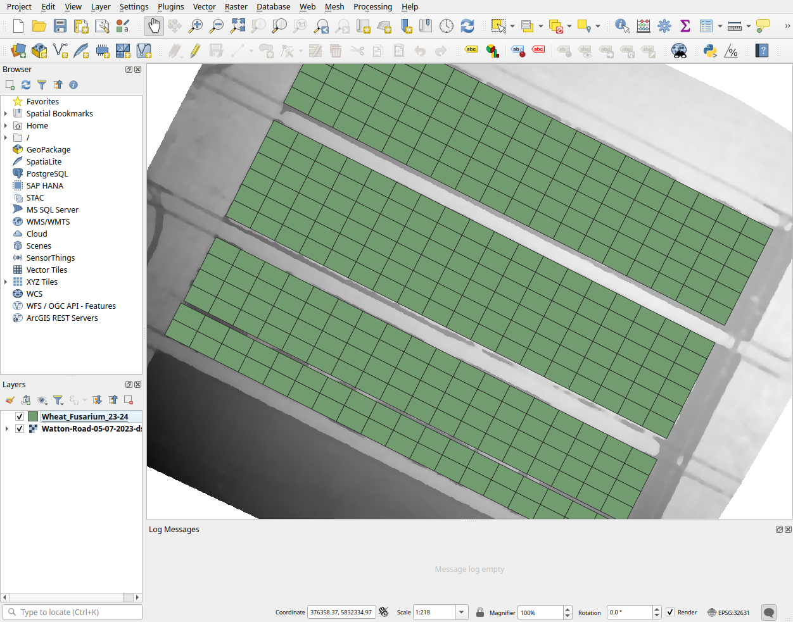

# QGIS-HighGround

A QGIS plugin for calculating percentiles from digital elevation model.

## Installation

Currently, installation is via downloading a released zip file and installing
using QGIS's "Install from ZIP" option.

**This is a very early release and so far has only been tested on Ubuntu 22.04
and with QGIS 3.40.3**

## Usage

Here we present a real world example of usage, we use for estimation of plant
height. Ensure at least one DSM raster and a vector shape file for the areas you care
about are loaded.

Select HighGround either through the plugin menu or toolbar, a dialog box will
then pop up. Select your raster and shape layers for analysis. Along with the 
percentile you want calculated and an output file to save your results to.

Click process and wait and a new layer will have been generated with your
results, which can be inspected (Identify features) or used for further 
analysis.

